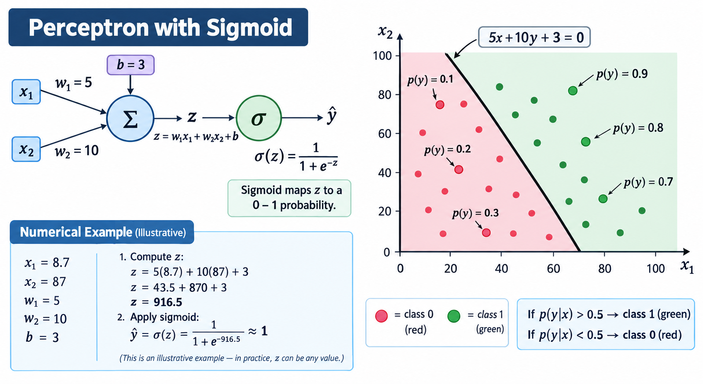

# Multi-Layer Perceptron — Intuition Notes
**Video:** How MLP captures non-linear decision boundaries (Series continuation)

---

## Recap — 
- Perceptron ki problem: wo sirf **linear decision boundary** (ek straight line) draw kar sakta hai.
- Agar data ko separate karne ke liye curved/complex boundary chahiye ho, to single perceptron fail ho jaata hai.
- **Solution:** Multi-Layer Perceptron (MLP) — multiple perceptrons ko combine karke ek bada network banana, jo **universal function approximator** ki tarah kaam karke kisi bhi non-linear boundary ko capture kar sakta hai.

## Goal
- Pehli baar MLP se properly introduce karwana, aur **first-principles intuition** dena ke ye non-linear boundaries kyun/kaise create kar paata hai — heavy math ke bina, sirf diagrams se.

---

## Part 1 — Perceptron with Sigmoid (Foundation)

- Is  mein jo base "perceptron" use ho raha hai, uska activation function **step function nahi, sigmoid hai**, aur loss function **log loss** hai — yani ye basically ek **logistic regression** unit hai.
- **Example:** Features = CGPA (x₁), IQ (x₂) → Output = Placement (yes/no)
- Sigmoid ka output binary (0/1) nahi hota — **0 se 1 ke beech ek probability** milti hai (placement hone ki probability).

### Diagram — Perceptron Structure

- **z = w₁x₁ + w₂x₂ + b**
- **σ(z) = 1 / (1 + e⁻ᶻ)** — sigmoid maps z ko 0–1 probability mein.

### Numerical Example (Illustrative)
Given: x₁ = 8.7 (CGPA), x₂ = 87 (IQ), w₁ = 5, w₂ = 10, b = 3

**Step 1 — z compute karo:**
z = 5(8.7) + 10(87) + 3 = 43.5 + 870 + 3 = **916.5**

**Step 2 — Sigmoid apply karo:**
ŷ = σ(916.5) = 1/(1 + e⁻⁹¹⁶·⁵) ≈ **1**

*(Ye ek illustrative example hai — practice mein z koi bhi realistic value ho sakta hai; itna bada z sirf demonstration ke liye hai ke bohot bada positive z sigmoid ko 1 ke bohot paas push kar deta hai.)*

### Geometric Interpretation — Decision Boundary Plot
- Trained model ki decision line: **5x + 10y + 3 = 0** — ye poore x₁-x₂ feature space ko **do regions** mein divide karti hai:
  - **Red region (class 0):** jahan p(y) < 0.5
  - **Green region (class 1):** jahan p(y) > 0.5
- **Rule:** agar p(y|x) > 0.5 → class 1 (green); agar p(y|x) < 0.5 → class 0 (red)
- **Boundary line ke exactly upar:** probability = 0.5 (bilkul uncertain)
- **Line se jitna door jaoge green side mein:** probability utni hi zyada badhti jaati hai — plot mein points dikhaye gaye hain jahan boundary ke paas p(y)=0.7, thoda aur door p(y)=0.8, sabse door p(y)=0.9
- **Line se jitna door jaoge red side mein:** probability utni hi kam hoti jaati hai — boundary ke paas p(y)=0.3, thoda aur door p(y)=0.2, sabse door p(y)=0.1
- Ye ek **smooth gradient** hai — sirf ek hard cutoff nahi; jitna point boundary se door hoga utna hi model confident hoga apni prediction mein.

---

## Part 2 — Do Perceptrons Ko Combine Karna (Core Intuition)

### Visual Intuition (Bina Math Ke)
- Do perceptrons train kiye gaye, dono ka apna-apna decision boundary (do alag lines).
- In dono lines ke outputs ko **superimpose** (like dono ko mila k upar rakhna) karo — ek naya combined decision region milta hai.
- Phir isme thoda **smoothing** karo — result ek curved, non-linear decision boundary hota hai jo pehle perceptron akela nahi bana sakta tha.
- **Ye pure conceptually dikhaya gaya — abhi tak koi mathematical justification nahi di gayi.**

### Mathematical Justification
- Har perceptron ek probability deta hai kisi bhi point ke liye (placement hone ki). Jaise: Perceptron 1 se → 0.8, Perceptron 2 se → 0.7
- **Naive approach:** dono probabilities ko simply **add** kar do → 0.8 + 0.7 = 1.5 — **problem: probability kabhi 1 se zyada nahi ho sakti!**
- **Fix:** is sum ko phir se **sigmoid function** mein daalo → sigmoid(1.5) ≈ 0.82 — ab ye ek valid probability ban jaati hai.
- **Combined model formula:** sigmoid(Perceptron1_output + Perceptron2_output)
- Ye essentially **do perceptrons ka linear combination** hai — jisse ek naya, zyada expressive model banta hai.

### Weighted Combination (Flexibility Add Karna)
- Agar chaho ke Perceptron 1 ka impact zyada ho Perceptron 2 se, to direct addition ki jagah **weights** add karo:
  
  **z = w_a · (Perceptron1 output) + w_b · (Perceptron2 output) + bias**
- Example: w_a = 2, w_b = 5, bias = 3 → z compute karo → sigmoid apply karo → final probability
- **Key insight:** Ye jo poori structure hai — do perceptrons ke outputs ko naye weights ke saath combine karke, bias add karke, sigmoid lagana — **ye khud bhi ek perceptron jaisa hi structure hai!**
- Matlab tum **perceptrons ka linear combination** bana rahe ho, jisse **Multi-Layer Perceptron (MLP)** banta hai — perceptron 1 aur 2 ke outputs, teesre perceptron ke inputs ban rahe hain.

### MLP Ki Layer Terminology
- **Input Layer:** raw data inputs (CGPA, IQ) yahaan se aate hain
- **Hidden Layer:** wo perceptrons jo input layer se input lete hain aur intermediate outputs produce karte hain (Perceptron 1 aur 2 yahaan hain)
- **Output Layer:** final perceptron jo hidden layer ke outputs ko combine karke final prediction deta hai

**Core takeaway:** MLP non-linear boundary isliye capture kar paata hai kyunke ye **multiple perceptrons ka linear combination** banata hai — simple idea, powerful result.

---

## Part 3 — Neural Network Architecture Mein Flexibility

Architecture ka matlab: nodes (perceptrons) aapas mein kis tarah connected hain aur weights kaisi hain. Architecture change karne ke **4 tareeqe:**

### 1. Hidden Layer Mein Nodes Badhana
- Hidden layer mein zyada perceptrons add karo (jaise 2 se 3).
- **Fayda:** Jitne zyada nodes, utni hi zyada **complex non-linear decision boundaries** capture ho paati hain — kyunke ab zyada lines ka linear combination ban raha hai.
- Har naya node = ek naya "vote" jo final decision mein contribute karta hai, apne khud ke weights ke saath.

### 2. Input Layer Mein Nodes Badhana
- Ye tab karte ho jab data mein **naya input column** aa jaaye (jaise CGPA, IQ ke saath 12th ke marks bhi add ho jaayein).
- 2 features → 2D space; 3 features → data **3D** mein chala jaata hai, aur perceptron model ek **plane** (line ke bajaye) banata hai.
- 2 planes ka linear combination lo → same process (weighted sum → sigmoid) → probability milti hai.
- 4+ features ke saath ye **hyperplane** ban jaata hai (visualize nahi kar sakte, par math wahi rehta hai).

### 3. Output Layer Mein Nodes Badhana
- Abhi tak sab examples mein sirf **ek output perceptron** tha (binary classification).
- **Multi-class classification** ke liye multiple output nodes rakh sakte ho — jaise photo classify karni ho Dog/Cat/Human mein, to teen alag output perceptrons banao (ek har class ke liye).
- Jis class ki probability sabse zyada ho, wahi final prediction hoti hai.

### 4. Hidden Layers Ki Number Badhana (Deep Neural Network)
- Abhi tak hum sirf ek hi hidden layer mein nodes add kar rahe the — ab **poori extra layers** bhi add kar sakte ho (jaise Hidden Layer 1 aur Hidden Layer 2).
- **Fayda:** Pehla hidden layer basic non-linear boundaries banata hai; agla hidden layer un boundaries ka **further linear combination** banakar aur bhi complex relationships capture karta hai.
- Isi wajah se Neural Networks ko **"Universal Function Approximator"** bola jaata hai — kaafi layers aur nodes ke saath, aur enough training time ke saath, network almost kisi bhi complex mathematical function ko approximate kar sakta hai.
- **Trade-off:** Zyada layers/nodes = zyada training time aur complexity, par zyada representational power bhi.

---

## Summary — Key Takeaways
1. Ek akela perceptron sirf **linear boundary** bana sakta hai — non-linear data ke liye insufficient hai.
2. **Multiple perceptrons ka weighted linear combination** (+ sigmoid) hi MLP ki foundation hai — ye conceptually "perceptrons ka perceptron" hai.
3. Architecture 4 tareeqon se flexible banaya ja sakta hai: **hidden nodes badhana, input nodes badhana (naye features), output nodes badhana (multi-class), aur hidden layers badhana (depth)**.
4. Jitni zyada layers aur nodes, utni hi zyada complex non-linear relationships capture ho sakti hain — isi wajah se NN ko **universal function approximator** kaha jaata hai.
5. Activation function ka choice (sigmoid vs ReLU) convergence speed pe bada impact daal sakta hai, especially complex datasets pe.
