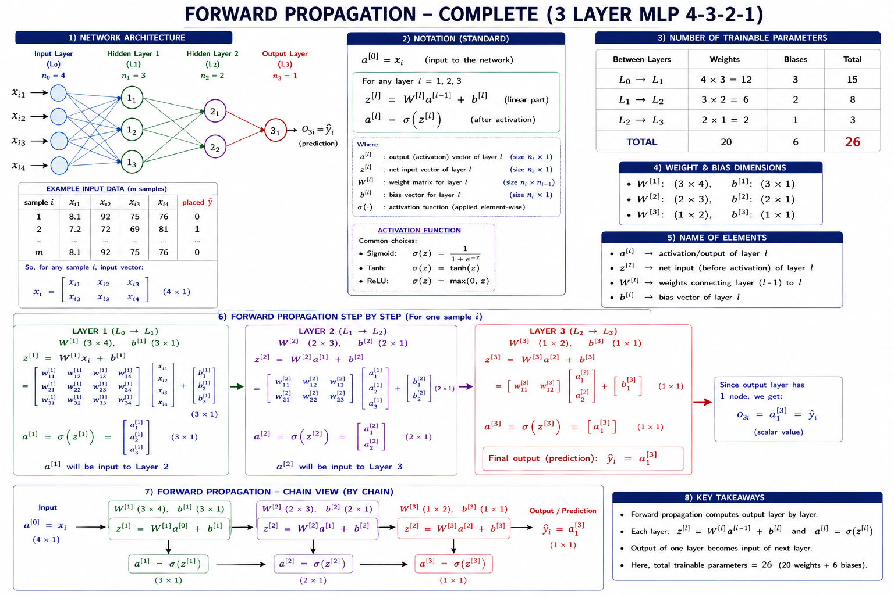

# Forward Propagation — Notes
**NOtes:** "Forward Propagation | How a neural network predicts output?" 

---

## Context
- pichli 2 videos Multi-Layer Perceptron (MLP) pe thi — pehli mein MLP intro, doosri mein weights/bias notation.
- Ab agla bada topic hai **Backpropagation** (jisse NN train hota hai) — jo thoda difficult samjha jaata hai.
- Isliye is  mein pehle **Forward Propagation** clearly samjhaya ja raha hai, taake Backpropagation samajhna aasan ho.

### Do Core Concepts (NN Training ke)
1. **Forward Propagation:** data (input) neural network mein aage badhta hai, layer by layer, jab tak output na mil jaaye.
2. **Backpropagation:** peeche ki taraf jaa kar weights update hote hain — isi se training hoti hai.

** focus:** sirf Forward Propagation — matlab, given input aur weights, network prediction kaise nikalta hai. Linear algebra (dot products, matrices) is poori process ko elegantly handle karta hai — chahe architecture kitna bhi bada ho.

---

## Example Network Setup

**Architecture:** 4 → 3 → 2 → 1 (input layer → hidden layer 1 → hidden layer 2 → output layer)

**Input Features (dataset):**
- CGPA
- IQ
- 10th ka marks
- Resume/box office score (placeholder feature)

**Output:** Placement hua ya nahi (yes/no)

### Total Trainable Parameters Calculate Karna
- **Input (4) → Hidden Layer 1 (3):** connections = 4 × 3 = 12 weights + 3 biases
- **Hidden Layer 1 (3) → Hidden Layer 2 (2):** connections = 3 × 2 = 6 weights + 2 biases
- **Hidden Layer 2 (2) → Output (1):** connections = 2 × 1 = 2 weights + 1 bias
- **Total = (12+3) + (6+2) + (2+1) = 26 trainable parameters** (approx, jaisa video mein calculate kiya gaya)

 Jab bhi kisi NN ke saath kaam karo, hamesha pata hona chahiye ke total trainable parameters kitne hain — training ke waqt optimizer inhi ki values dhoondta hai.

---

## Weight Notation

- Weight likhne ka tareeqa: **w[layer][from_node][to_node]** ya — w₁₁, w₁₂, w₁₃ (layer 1 se node 1 se aage jaane wale weights), phir w₂₁, w₂₂, w₂₃ (node 2 se), aur isi tarah aage.
- **Weight Matrix banane ka rule:**
  - Row = **source node** (jahan se weight nikal raha hai)
  - Column = **destination node** (jahan weight ja raha hai)

---

## Forward Propagation — Step-by-Step (Matrix Method)

### General Formula (Single Neuron)
Kisi bhi perceptron ka output nikalne ka formula:

**z = (weights · inputs) + bias**
**output = σ(z)**  ← sigmoid (ya koi activation function) apply karna

### Layer 1: Input → Hidden Layer 1

1. **Input vector:** x (4×1 matrix) — CGPA, IQ, 10th marks, aur 4th feature ki values
2. **Weight matrix W₁** banao (input nodes × hidden nodes se) — phir isko **transpose** karo taake matrix multiplication ke dimensions match ho jaayein
3. **Matrix multiplication:** W₁ᵀ (3×4) × x (4×1) = ek naya matrix (3×1)
4. Isme **bias vector** add karo (3×1)
5. Result pe **sigmoid function** apply karo — final output milta hai layer 1 ka: ek 3×1 matrix (jisme 3 values hain — O₁, O₂, O₃)

**Ye 3 outputs (O₁, O₂, O₃) hi agle layer ke liye input banenge.**

### Layer 2: Hidden Layer 1 → Hidden Layer 2

- Same process repeat: pehle wale layer ka output (3×1) ab naya input hai
- **Weight matrix W₂** (3 nodes se 2 nodes tak) banao, transpose karo
- Matrix multiply: W₂ᵀ (2×3) × previous output (3×1) = (2×1) matrix
- Bias add karo, sigmoid apply karo → 2 outputs milte hain (agle layer ke liye input)

### Layer 3: Hidden Layer 2 → Output

- Same process: weight matrix W₃ (2 nodes se 1 node tak) banao, transpose karo
- Matrix multiply: (1×2) × (2×1) = (1×1) single value
- Bias add karo, sigmoid apply karo → **final prediction (ŷ)** mil jaata hai — ek single number

**Har step mein same 3-step process repeat hota hai: Multiply → Add Bias → Apply Activation.**

---

## Notation Convention (General)

- **a⁽⁰⁾** = input layer ka activation (raw input values)
- **a⁽¹⁾** = layer 1 ka output/activation
- **a⁽²⁾** = layer 2 ka output/activation
- **a⁽³⁾** = final output/activation (prediction)

### General Formula Chain
```
a⁽¹⁾ = σ(W⁽¹⁾ · a⁽⁰⁾ + b⁽¹⁾)
a⁽²⁾ = σ(W⁽²⁾ · a⁽¹⁾ + b⁽²⁾)
a⁽³⁾ = σ(W⁽³⁾ · a⁽²⁾ + b⁽³⁾)   ← ye hi final prediction hai (ŷ)
```

**Ye poora chain ek hi bade nested expression mein bhi likha ja sakta hai** — jitne zyada layers hongi, expression utna hi bada hota jaayega. Par ye "complexity" sirf isliye handle ho jaati hai kyunke matrix algebra ise organized tareeqe se compute kar leta hai.

---

## Key Takeaways
1. Forward propagation = input ko layer-by-layer aage propagate karna (multiply → bias add → activation) jab tak final prediction na mil jaaye.
2. Chahe architecture kitna bhi complex ho, underlying operation hamesha same rehta hai — **matrix multiplication + bias addition + activation function**.
3. Weights training se pehle **random values** se initialize hote hain.


